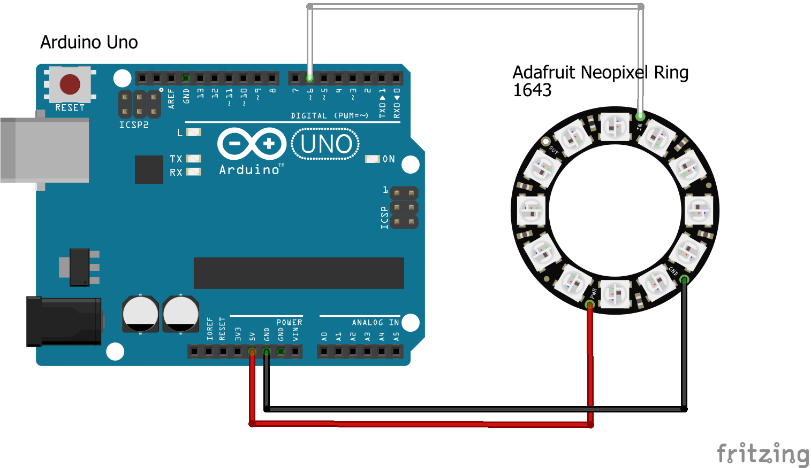

# VisualMetronome
An Arduino based USB MIDI metronome that uses LEDs to signal tempo

Visual Metronome is a USB MIDI device which flashes bright RGB LEDs to visually indicate musical bars and beats very much like an audible metronome.  Note events from a MIDI Sequencer or DAW turn on the LEDs and the LEDs remain on for the duration of the note.  Different colors are assigned to note values and <TO DO> the brightness of the LEDs is determined by note velocity </TO DO>.  A MIDI sequence or track is created in the sequencer which "plays" the LEDs exactly as you would play any other externally attached MIDI device.  The composer would typically play an LED on beat 1, 2, 3 and 4 however the LEDs can be played to represent any other subdivision or even arbitrarily.

Visual Metronome is intended to replace or supplement an audible click style metronome.  In many cases an audible click is not suitable.  For example an audible metronome can cause "headphone bleed" into sensitive microphones.  Audible clicks may also not "feel" right in certain styles of music such as very slow or legato pieces.  Audible metronomes also require that musicians wear headphones sometimes in situations where they would rather not.  A very loud audible metronome can cause ear pain or hearing damage.

The design goal of Visual Metronome is to be simple and inexpensive to build.  It is also intended to be simple and "idiot proof" to use.

Visual Metronome's hardware consists of an Arduino Uno and an Adafruit Neopixel Ring.  The Neopixel ring is attached to the Uno as shown in the included diagram.  The following connections are required:

| Uno        | Neopixel           | Wire Color  |
| ------------- |:-------------:| -----:|
| GND      | GND | Black |
| 5v      | PWR      |   Red |
| 6 | In      |    White |

Power is supplied to Visual Metronome by the computer via the USB cable.  The computer provided power is sufficient to run the Uno and the Neopixel ring.  If you wish to modify the project and use more than 12 Neopixels then you may need to also provide an additional power source.

Visual Metronomes software consists of two components - the USB firmware and the Arduino sketch.

## USB Firmware

The Arduino Uno's ATMega16u2 microcontroller must be reprogrammed with the provided firmware.  This firmware causes the device to become a class compliant HID (Human Interface Device).  This means that when the device is connected to a computer (Windows, OSX, Linux) with a USB cable it will be detected as a standard MIDI device and the operating system will automatically load the driver.  In your computer's device manager and in your DAW or Sequencer the device will appear as 'Visual Metronome'.

## Arduino Sketch

The Arduino Uno's ATmega328P microcontroller must also be programmed with the provided Arduino Sketch.  This is the software that tells the microcontroller how to flash the LEDs upon receiving incoming MIDI notes.
